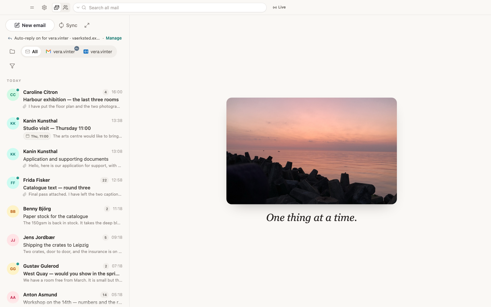
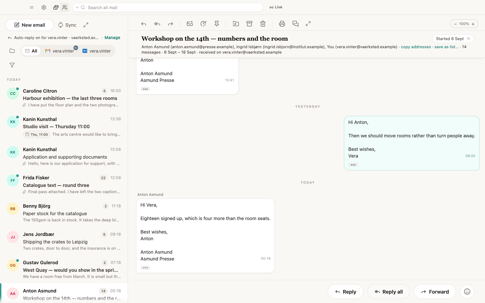
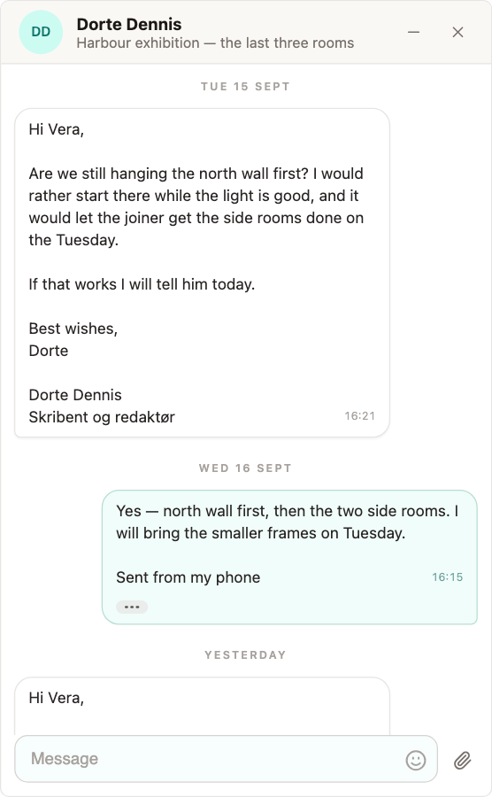
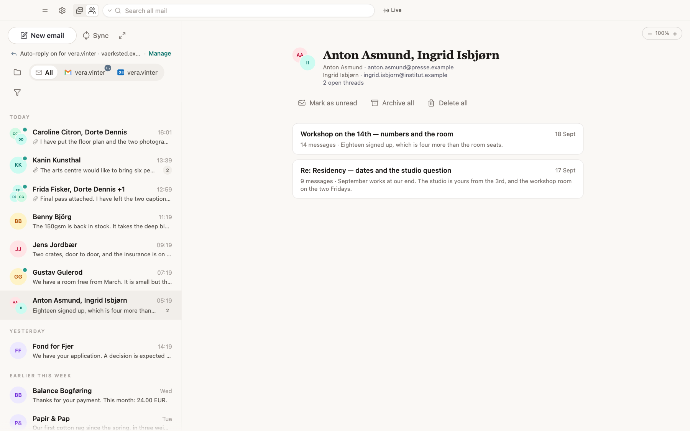
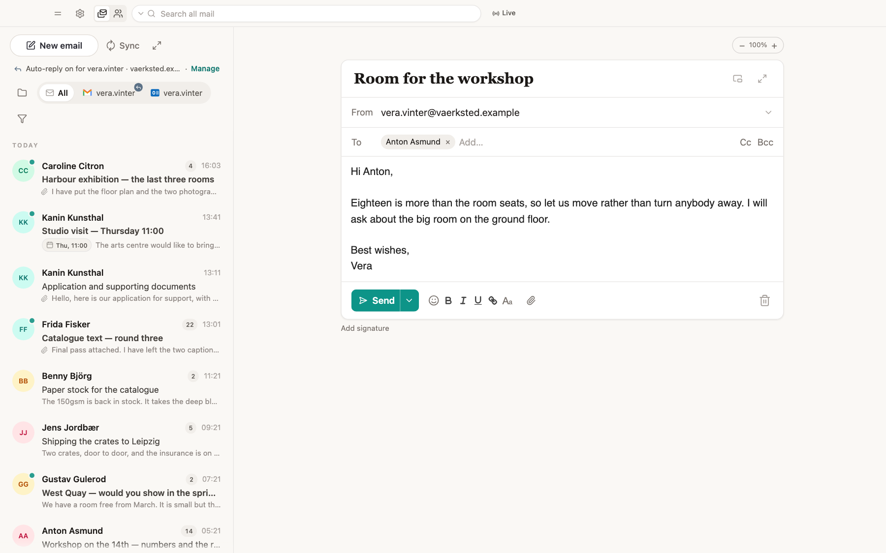

# Digital Habits: Mail

A minimalistic email client for people who find email overwhelming. Designed
with ADHD in mind. Developed by Centre for Digital Habits (digitalhabits.org;
lead developer is Dr Ulrik Lyngs, ulrik@digitalhabits.org), in collaboration
with computer scientists and human-computer interaction researchers at the
Universities of Oxford, Maastricht, Copenhagen, and Santa Clara (see [digitalhabits.org/story](https://digitalhabits.org/story)).

> **This is a snapshot of the latest release(s), not the development history.**
>
> The app is built in our private monorepo, as part of the project management
> tools we use daily in our team. We export major releases here whole, so one commit
> is one version rather than one change.
>
> It is published so the code can be read and checked. Issues are welcome; see
> the note on pull requests at the end.



## Why

We run workshops on digital distraction, and the same thing comes up in every
one: students have given up on email. There is too much of it, and it works
nothing like the messaging apps they use all day. For neurodiverse students it
is harder again.

Email is not going away, so this is an attempt at a less overwhelming way to
read it:

- **Threads read like a chat.** A conversation is laid out the way a messaging
  app lays one out, instead of as nested quoted replies.
- **One-click focus.** Any part of the app can be turned into a distraction-free full
  screen: only the thread you are reading, only the message you are writing,
  only the inbox.
- **Pop a conversation out.** A thread can be popped out into an oldschool chat window that
  stays on top of whatever else you are doing: just your conversation with
  that person or those people, with nothing else from the inbox in it. Reply
  from there, and put it back when you are done.
- **Group by person, or by thread.** In
  the by-person view, every new email from someone becomes another entry under
  them rather than a new thread, the way a messaging app does it, which removes
  most of the clutter.



<p align="center">
  <em>A conversation of fourteen messages, read the way a chat is read. The
  quoted tail every client sends is folded behind the dots.</em>
</p>

<p align="center">
  
</p>

<p align="center">
  <em>A thread popped out on its own, staying above whatever else you are working in.</em>
</p>



<p align="center">
  <em>Grouped by person instead of by thread. Everything still open with one
  correspondent sits on one page, and what can be done to all of it at once
  is said in words above it.</em>
</p>



<p align="center">
  <em>Writing a message. The few controls worth a click sit in one row. Lists,
  font, size, colour and highlight wait behind the Aa, where they are out of
  the way of the writing.</em>
</p>

## How it works

A desktop app for macOS and Windows that reads Gmail and Outlook directly from
the machine it runs on. No server of ours sits in between.

- **Gmail** is read over IMAP and sent over SMTP, with an OAuth token
  (SASL XOAUTH2). See `products/mail/crates/mail-native/src/imap.rs` and
  `smtp.rs`. This is why the app asks Google for the full-mailbox scope: it
  is the only scope Gmail's IMAP and SMTP servers accept. The Gmail REST API
  is used for the out-of-office reply and the send-as name, and for a mailbox
  whose local copy is not yet complete.
- **Outlook** is read and sent through Microsoft Graph.
- The app keeps a local copy of each mailbox in a SQLite file on your machine.
- Refresh tokens are kept in the operating system's store: the keychain on
  macOS, Credential Manager on Windows.

[SECURITY.md](SECURITY.md) lists every host the app talks to and every
permission it asks for, with the file that does it.

Extracted from a private monorepo, so the directory layout is the monorepo's.
That is deliberate: `vite.config.ts`, `build-aliases.mjs` and `tsconfig.json`
are copied unmodified, so this builds the way the released app builds.

## Building

Needs Node 20 or later, pnpm 9, and a Rust toolchain. On macOS it also needs the Xcode
command line tools. On Windows it needs the MSVC build tools.

```
pnpm install
pnpm --dir apps/mail app:dev:demo           # run it with an invented mailbox
pnpm --dir apps/mail app:dev                # run it with your own mailboxes
pnpm --dir apps/mail test                   # the suites
pnpm --dir apps/mail typecheck
cd products/mail/crates/mail-native && cargo test --lib   # IMAP, SMTP, the store, OAuth
```

The release builds are `pnpm --dir apps/mail app:build` on macOS and
`pnpm --dir apps/mail app:build:win` on Windows. They sign the app only when
the signing credentials are in the environment. Without them the build is
unsigned.

To sign in to a mailbox you need your own OAuth clients. Put them in
`apps/mail/.env.local`:

```
VITE_GOOGLE_CLIENT_ID=
VITE_GOOGLE_CLIENT_SECRET=
VITE_MICROSOFT_CLIENT_ID=
```

The Google client is of type "Desktop app". The Microsoft one is an Entra
registration with a "Mobile and desktop applications" platform on
`http://localhost`. Both are free. Neither has to be verified to sign in to
your own mailbox. The demo mailbox needs none of them.

## What is here

- `apps/mail` — the desktop app: the Tauri shell in `src-tauri`, and the seams
  in `src/seams` that make the mail interface run with no server behind it
- `products/mail/crates/mail-native` — the Rust core: IMAP, SMTP, MIME, the
  sync loop, the local store, OAuth and the keychain
- `products/mail/packages/mail` — the mail interface and the logic under it
- `packages/shared` — code that the monorepo this came from also uses elsewhere

## Licence

None yet. All rights reserved: you may read this and fork it on GitHub, and
nothing further is granted for now.

Not accepting pull requests yet, for the same reason — without licence terms
there is nothing to say what either of us may do with a contribution.
