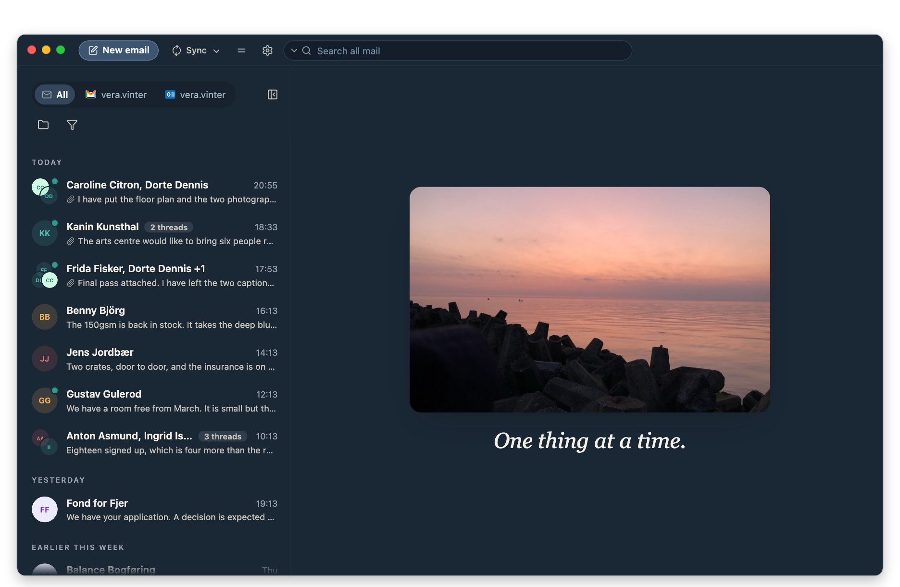
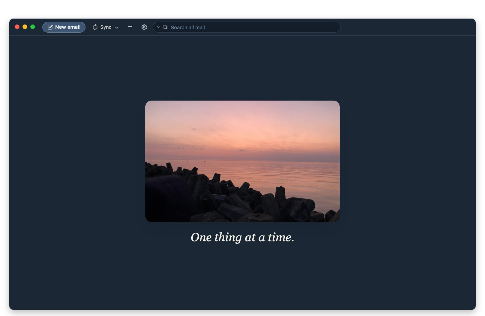
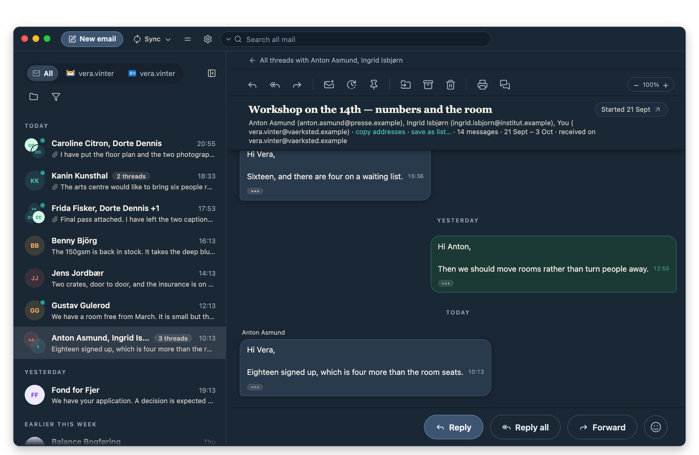
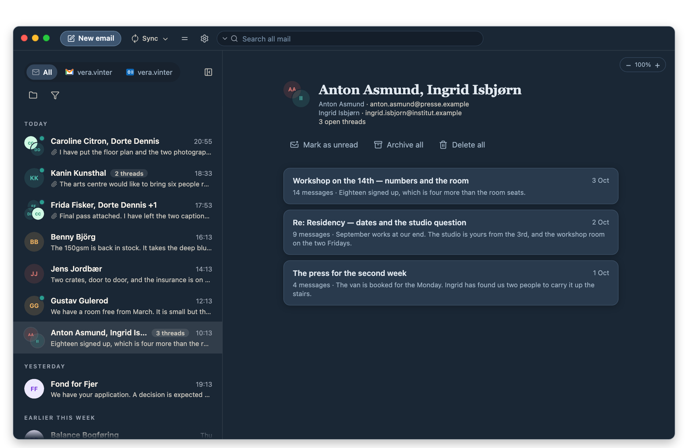
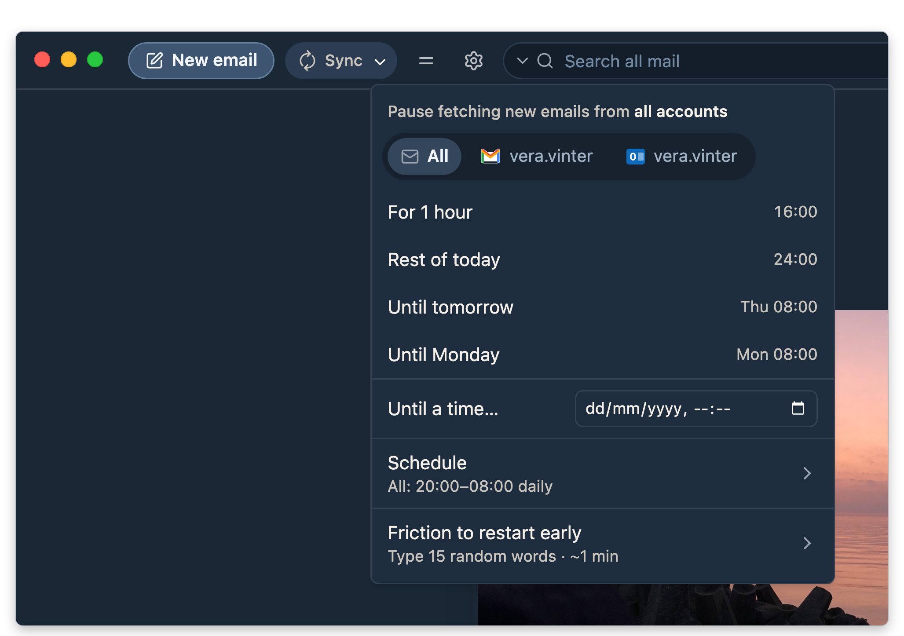
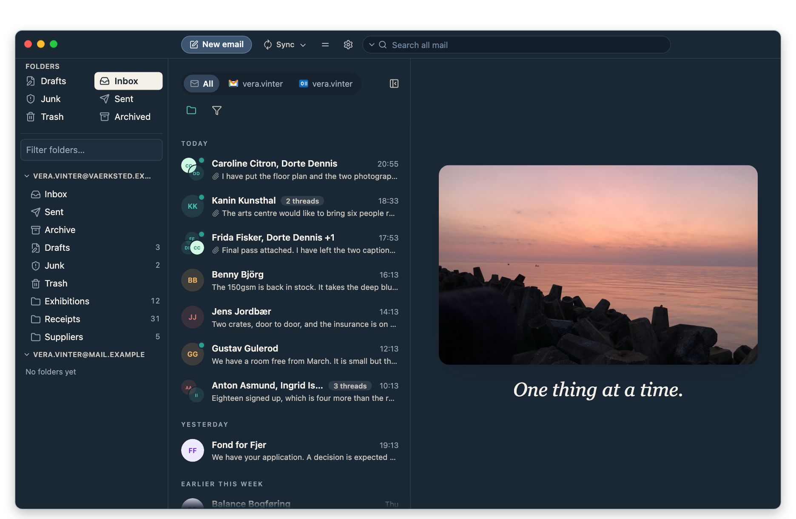
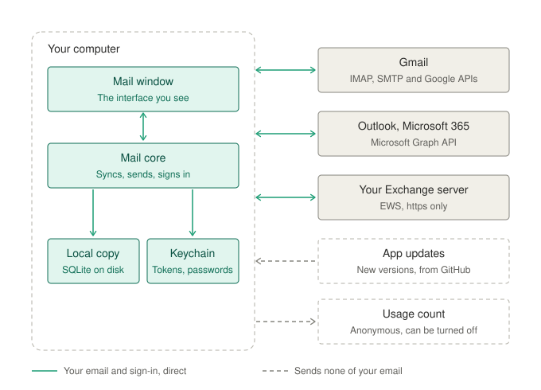

# Digital Habits: Mail (beta)

An email app for those of us who find email overwhelming. Works with your Gmail, Outlook and Microsoft Exchange accounts.



Developed by Centre for Digital Habits (digitalhabits.org; lead developer Dr Ulrik Lyngs, ulrik@digitalhabits.org), in collaboration
with computer scientists and human-computer interaction researchers at the Universities of Oxford, Maastricht, Copenhagen, and Santa Clara (see [digitalhabits.org/story](https://digitalhabits.org/story)).


> **This is a snapshot of the latest release(s), not the development history.**
>
> The app is built in our private monorepo, as part of the project management
> tools we use daily in our team. We export major releases here whole, so one commit
> is one version rather than one change.
>
> It is published so the code can be read and checked. Issues are welcome; see
> the note on pull requests at the end.

## Why

We run workshops on digital distraction, and the same thing comes up in every
one: students have given up on email. There is too much of it, and it works
nothing like the messaging apps they use all day. For neurodiverse students it
is harder again.

Email is not going away, so this is an attempt at a less overwhelming way to
read it:

- **Threads read like a messaging app.** A conversation is laid out the way a messaging
  app lays one out, instead of as nested quoted replies.
- **One-click focus.** Any part of the app can be turned into a distraction-free full
  screen: only the thread you are reading, only the message you are writing,
  only the inbox.
- **Emails from the same sender are grouped .** By default, a new email from the same sender are grouped together. No more having your inbox flooded by 8 emails from your airline company -- they're grouped together (you can turn this off in Settings, if you don't like it!).

<p align="center">
  
  <br>
  <em>Hide the sidebar for a distraction-free, calm view.</em>
</p>

<p align="center">
  
  <br>
  <em>Mail threads are shown as message-style bubbles.</em>
</p>

<p align="center">
  
  <br>
  <em>Multiple email threads with the same sender are grouped together so they don't flood your inbox.</em>
</p>

<p align="center">
  
  <br>
  <em>Pause fetching new emails for a while or on a schedule, so that, for example, you never get work email after 8 p.m.</em>
</p>

<p align="center">
  
  <br>
  <em>Easily see folders for all your accounts.</em>
</p>

### Also in Mail

- **Hide an email account on a schedule.** For example, your work account can
  disappear from Mail after work, so you cannot see work email in the evening.
- **Set your out-of-office reply from Mail**, for one account or for all of
  them at once.
- **Filters.** Show only the messages from specific senders, and have a filter
  turn on by itself at set hours.
- **Pop a conversation out.** A thread can be popped out into a small chat
  window that stays on top of whatever else you are doing. Reply from there,
  and put it back when you are done.
- **And much more...**

## How it works

A desktop app for macOS and Windows that reads Gmail, Outlook and Microsoft
Exchange directly from the machine it runs on. No server of ours sits in
between. The app collects no personal data, only an anonymous daily usage
count that you can turn off (see [SECURITY.md](SECURITY.md)).

<p align="center">
  
</p>

- **Gmail** is read over IMAP and sent over SMTP, with an OAuth token
  (SASL XOAUTH2). See `products/mail/crates/mail-native/src/imap.rs` and
  `smtp.rs`. The Gmail REST API is used for the out-of-office reply and the
  send-as name, and for a mailbox whose local copy is not yet complete.
- The app asks Google for the full-mailbox scope, `https://mail.google.com/`,
  for two reasons. It is the only scope Gmail's IMAP and SMTP servers accept.
  And the app has "Delete forever": in Trash and in Junk you can delete for
  good the conversations that you pick, which no narrower scope allows. The
  app asks first, and then waits eight seconds with an Undo before it tells
  the server. It has no "Empty Trash": it never deletes a folder, only what
  you picked. See `actions.rs` in the same crate.
- **Outlook** is read and sent through Microsoft Graph.
- **Microsoft Exchange** (an organisation's own Exchange server) is read and
  sent over Exchange Web Services (EWS), at the server's `https://` address
  only. You sign in with your username and password. See `ews.rs` and
  `ntlm.rs` in the same crate.
- The app keeps a local copy of each mailbox in a SQLite file on your machine.
- Refresh tokens, and an Exchange password, are kept in the operating
  system's store: the keychain on macOS, Credential Manager on Windows.
- The direct downloads (the `.dmg` and the Windows installer) check this
  repository's releases for a new version. They install one only if it is
  signed with the key built into the app. The store versions are updated by
  the store.

[SECURITY.md](SECURITY.md) lists every host the app talks to and every
permission it asks for, with the file that does it.

Extracted from a private monorepo, so the directory layout is the monorepo's.
That is deliberate: `vite.config.ts`, `build-aliases.mjs` and `tsconfig.json`
are copied unmodified, so this builds the way the released app builds.

## Building

Needs Node 20 or later, pnpm 9, and a Rust toolchain. On macOS it also needs the Xcode
command line tools. On Windows it needs the MSVC build tools.

```
pnpm install
pnpm --dir apps/mail app:dev:demo           # run it with an invented mailbox
pnpm --dir apps/mail app:dev                # run it with your own mailboxes
pnpm --dir apps/mail test                   # the suites
pnpm --dir apps/mail typecheck
cd products/mail/crates/mail-native && cargo test --lib   # IMAP, SMTP, the store, OAuth
```

The release builds are `pnpm --dir apps/mail app:build` on macOS and
`pnpm --dir apps/mail app:build:win` on Windows. They sign the app only when
the signing credentials are in the environment. Without them the build is
unsigned.

To sign in to a mailbox you need your own OAuth clients. Put them in
`apps/mail/.env.local`:

```
VITE_GOOGLE_CLIENT_ID=
VITE_GOOGLE_CLIENT_SECRET=
VITE_MICROSOFT_CLIENT_ID=
```

The Google client is of type "Desktop app". The Microsoft one is an Entra
registration with a "Mobile and desktop applications" platform on
`http://localhost`. Both are free. Neither has to be verified to sign in to
your own mailbox. The demo mailbox needs none of them.

## What is here

- `apps/mail` — the desktop app: the Tauri shell in `src-tauri`, and the seams
  in `src/seams` that make the mail interface run with no server behind it
- `products/mail/crates/mail-native` — the Rust core: IMAP, SMTP, MIME, the
  sync loop, the local store, OAuth and the keychain
- `products/mail/packages/mail` — the mail interface and the logic under it
- `packages/shared` — code that the monorepo this came from also uses elsewhere

## Licence

None yet. All rights reserved: you may read this and fork it on GitHub, and
nothing further is granted for now.

Not accepting pull requests yet, for the same reason — without licence terms
there is nothing to say what either of us may do with a contribution.
